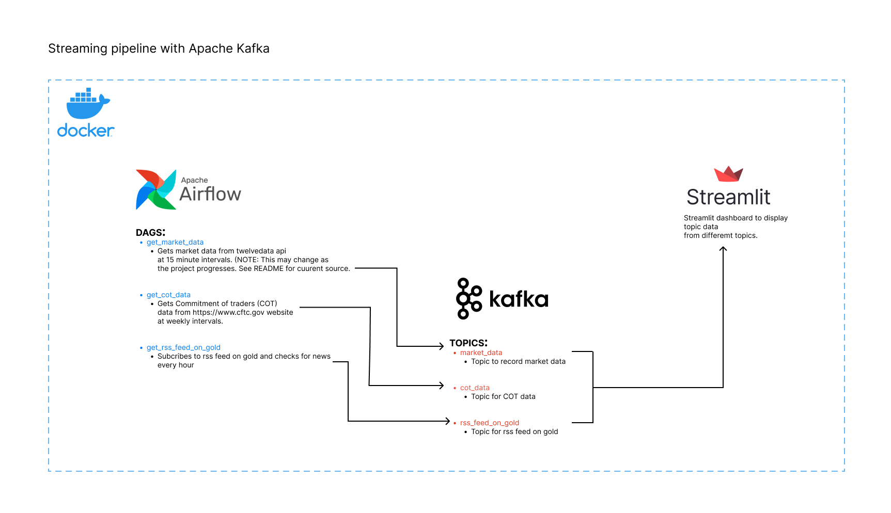

# Trading gold

## But why gold?
Since ancient civilization, from the Egyptians to the Inca, gold has held a special place of actual and symbolic value for humanity. Gold has moreover been used as money for exchange, as a store of value, and as valuable jewelry and other artifacts. ~ [investopedia](https://www.investopedia.com/articles/investing/071114/why-gold-has-always-had-value.asp#:~:text=Key%20Takeaways,valuable%20jewelry%20and%20other%20artifacts.)
Its unique properties of durability, malleability and conductivity make it a very desirable and in-demand metal for everything from industrial applications to jewelry.

This project aims to aid in the analysis of gold against the US Dollar through the use of a dashboard that displays Commitment of traders report data, sentiment on gold and the current price.

## What I learned

- How to build and deploy a multi-docker container service where each container is a service.
- How to get data from different sources namely: APIs, Text and RSS using python.
- How to configure and run airflow on docker
- How to configure and run kafka on docker

## Architecture Overview



## User Instructions
The timeframe used to trade gold is a matter of personal preference however as stated by [Justforex, 2021](https://justforex.com/education/forex-articles/best-time-to-trade-gold#:~:text=To%20make%20the%20best%20out,trigger%20significant%20gold%20price%20changes.), it is best to trade during times of high volume on intraday timeframes.
The dashboard shows price at 15 minute intervals to make looking for entry points easier. 
It also shows COT data and sentiment data. More details on how to use these asset can be found [here](https://www.dailyfx.com/education/market-sentiment).

## Developer Instructions

### Prerequisites
- Docker and docker-compose

  This project is built on docker and uses docker-compose to spin up a multi container environment. More details on how to install docker docker-compose for your OS can be found [here](https://docs.docker.com/desktop/)

- virtual environment
  Each service has its own requirements file used in its in docker file however for local development and testing a virtual environment is needed and requirements installed. More information [here](https://www.geeksforgeeks.org/).

### Run the project
The project has three docker compose files for each service defined above. Therefore to run this project, start by initializing the airflow instance.
```
> docker-compose airflow\airflow-compose.yml airflow-init up -d 
```
Then run
```
> docker-compose -f airflow\airflow-compose.yml -f kafka\kafka-compose.yml -f dashboard\dashboard-compose.yml up -d 
```
The following is a result of the above commands

`TO DO:
include snippet of docker desktop when all containers are running`
